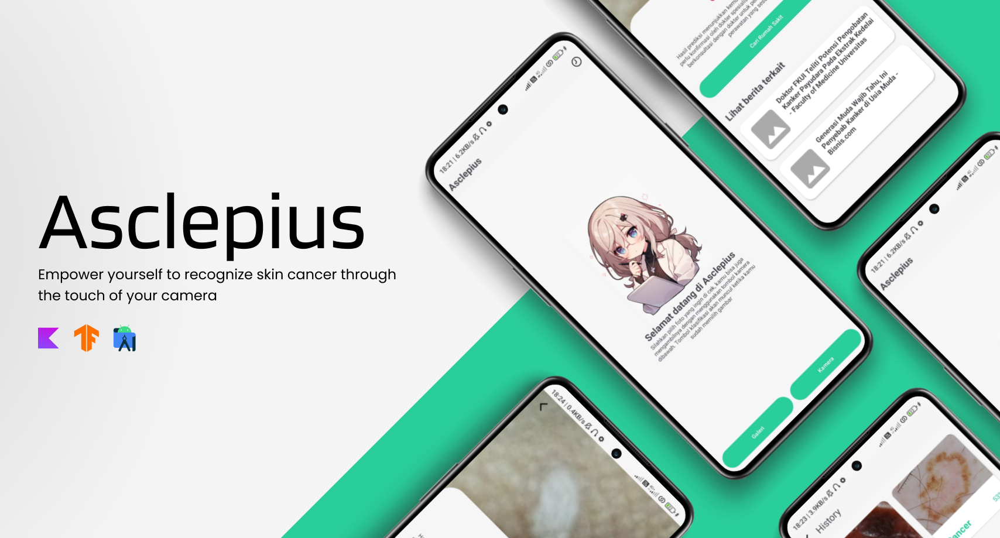

<h1 align="center">Asclepius</h1>

Asclepius is an Android application developed in Kotlin and Java, using the Android Studio Iguana | 2023.2.1 Patch 2 IDE. The application uses Gradle for build automation.

## Features

-   Image-based disease prediction
-   Confidence score for predictions
-   Relevant news articles based on the prediction
-   Hospital locator

## Getting Started

These instructions will get you a copy of the project up and running on your local machine for development and testing purposes.

### Prerequisites

-   Android Studio Iguana | 2023.2.1 Patch 2 or later
-   Android SDK (specified in `local.properties`)

### Installing

1. Clone the repository: `git clone https://github.com/xirf/asclepius.git`
2. Open the project in Android Studio
3. Get your news API key from [NewsAPI](https://newsapi.org/)
4. Add the API key to the `local.properties` file as `API_KEY="<your API key>"`
5. Sync the Gradle files and build the project
6. Run the project on an emulator or a physical device

## Contributing

Everyone is welcome to contribute to the project. feel free to fork the repository and submit a pull request.

## Authors

-   **dicoding** - _Initial work and starter template_ - [dicoding](https://github.com/dicodingacademy/)
-   **xirf** - _Development and enhancements_ - [xirf](https://github.com/xirf)

## License

This project is licensed under the MIT License - see the `LICENSE.md` file for details
